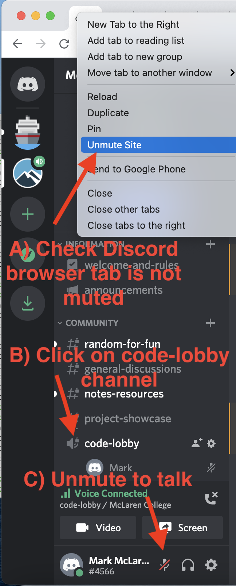
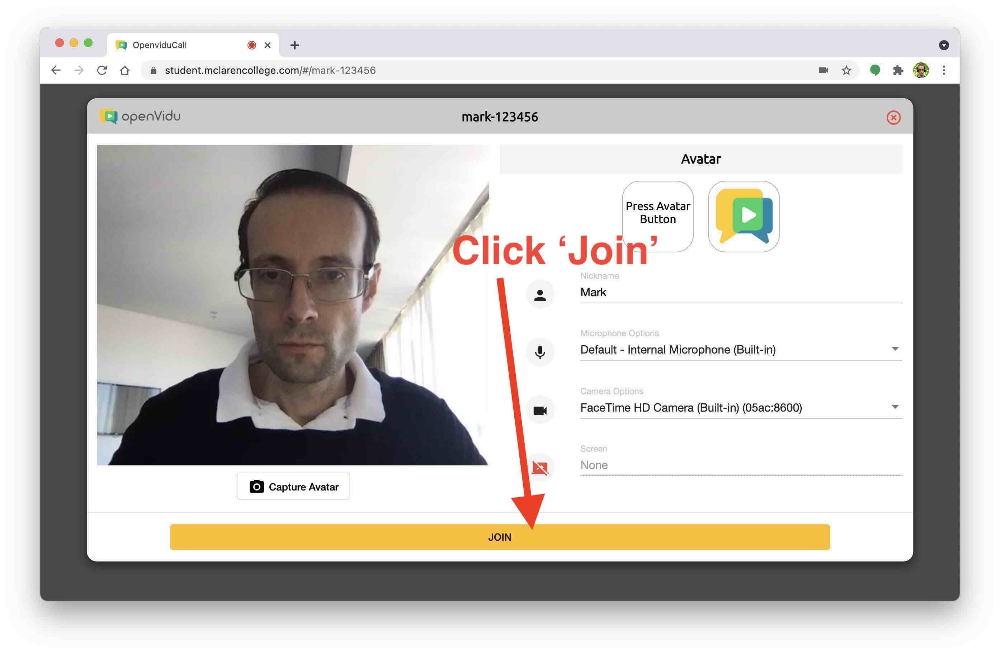
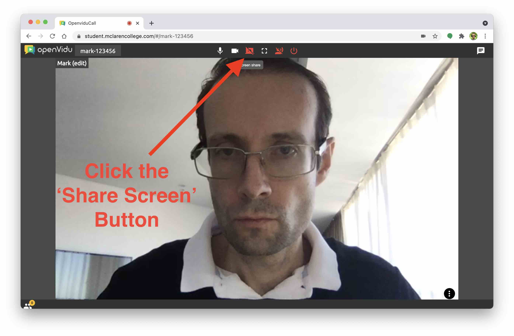
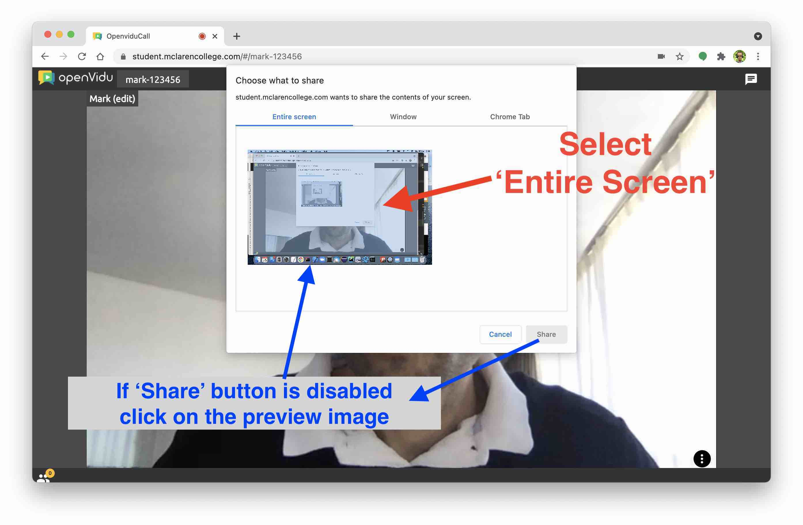
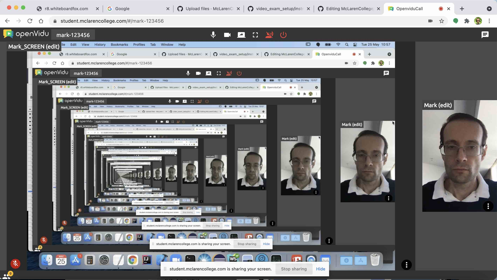
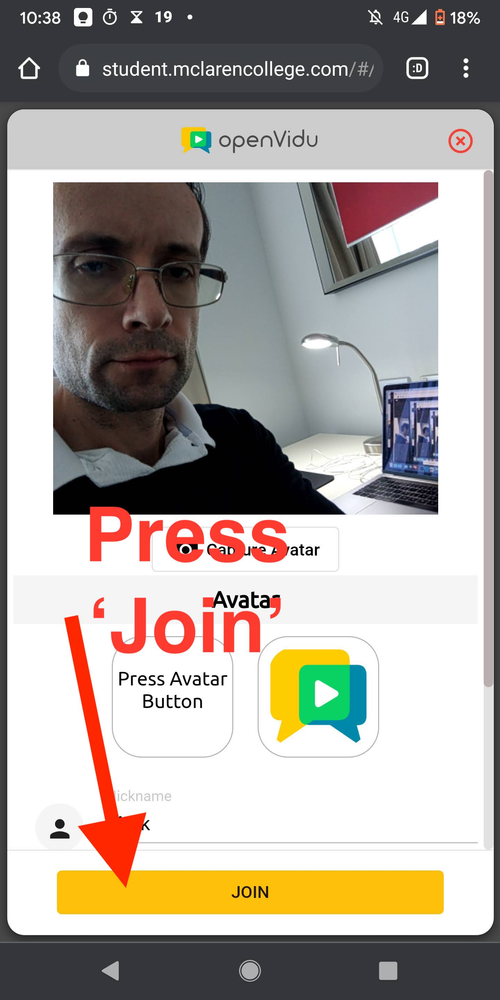
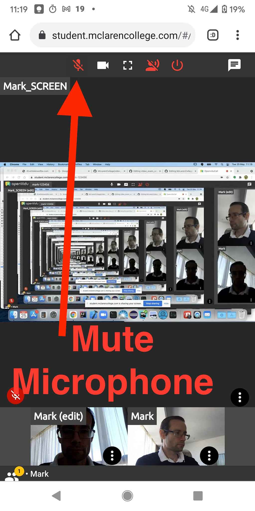
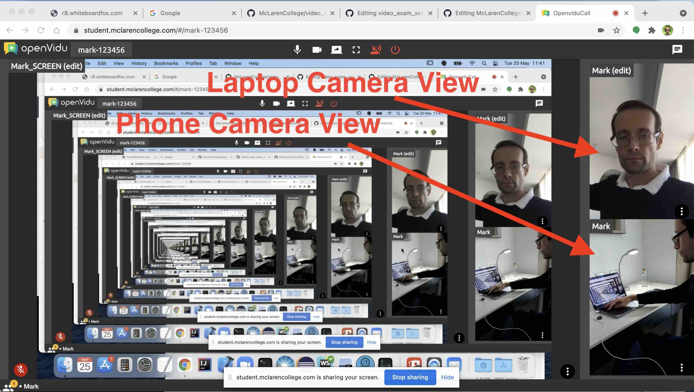

# How To Set Up Your Exam Video Call

### Step 1: Initial Setup
* Ensure your laptop and phone are fully charged. Connect your laptop to a power socket, and connect your phone to a power bank if you have one.
* Check the correct phone camera position as [shown in this video](https://youtu.be/b9Y_takbF5s)
* If you have a second monitor, turn it off
* Disable Ad-blocking and browser extensions on your laptop

### Step 2: Connect to Discord Audio Channel

### Step 3: Get Your Personal Video Link
Check with the exam administrator for your video call link.

### Step 4: Open the Link On Your Laptop and Click 'Join'

### Step 5: Click the 'Share Screen' Button and Share Entire Screen
 

### Note: Your Page Should Now Look Like This

### Step 6: On Your Phone Open the Call Link and Press 'Join'

### Step 7: Mute Phone Microphone

### Step 8: Check Both Camera Views Are Visible in Call

### Step 9: Confirm Corret Setup with Exam Administrator

Send a Discord message to ask if your call is set up correctly.  Once confirmed, you can begin the exam questions.  After you finish, just close the call browser tab on your laptop and phone.

