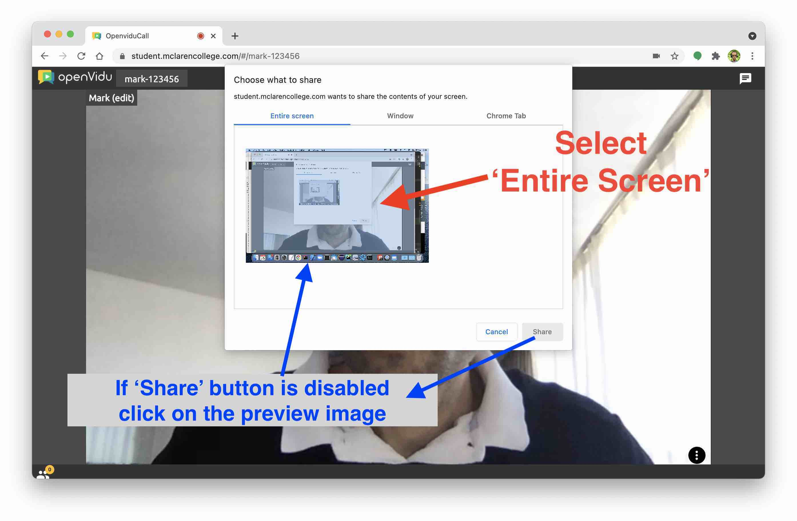
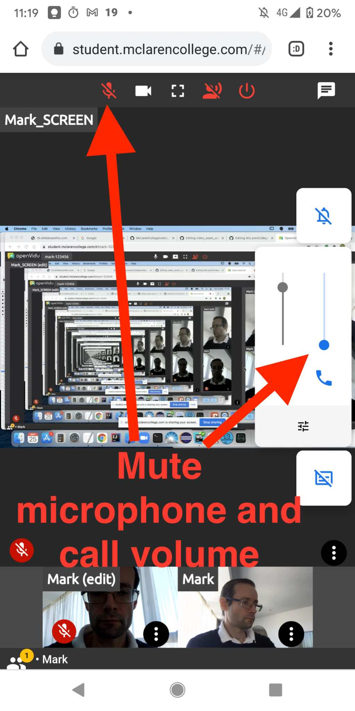

# How To Set Up Your Exam Video Call

### Step 1: Get Your Personal Video Link
Check with the exam administrator for your video call link.  Each student has a different link - do not share your link with another student.

### Step 2: Open the Link On Your Laptop and Click 'Join'

### Step 3: Click the 'Share Screen' Button

### Step 4: Select 'Entire Screen'
If the 'Share' button is disabled, double-click on the preview image.

### Note: Your Page Should Now Look Like This

### Step 5: On Your Phone Open the Call Link and Press 'Join'

### Step 6: Mute Phone Microphone and Speaker

### Step 7: Check Both Camera Views Are Visible in Call

